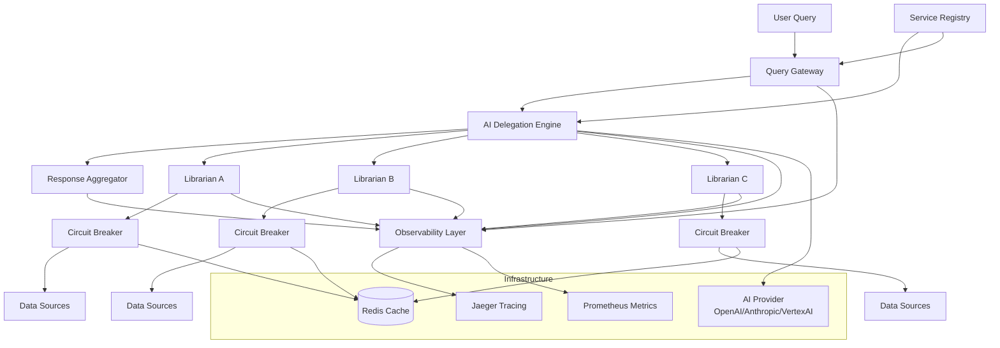
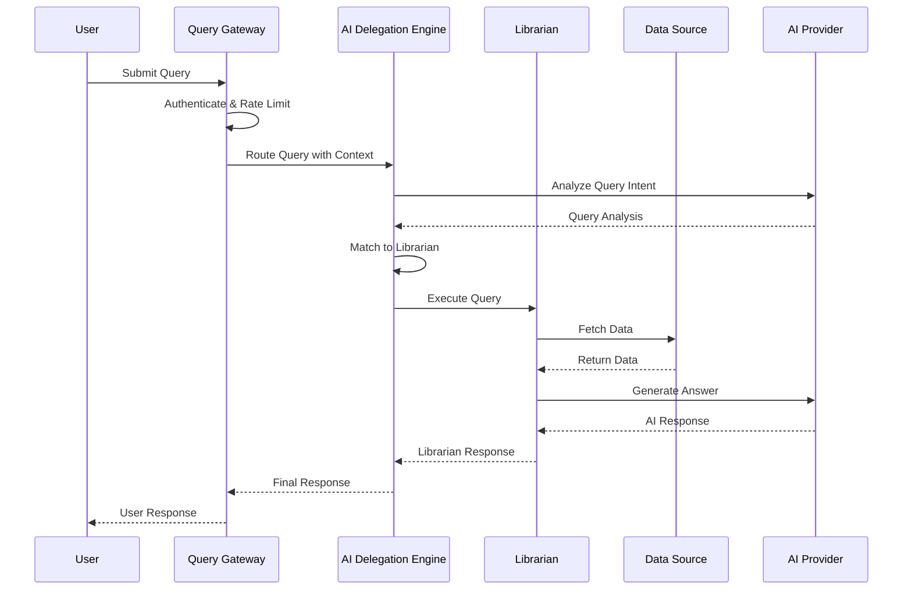
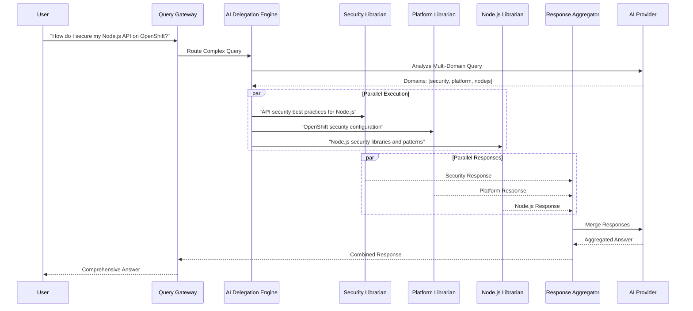
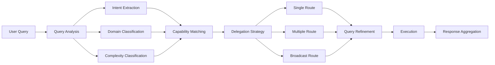
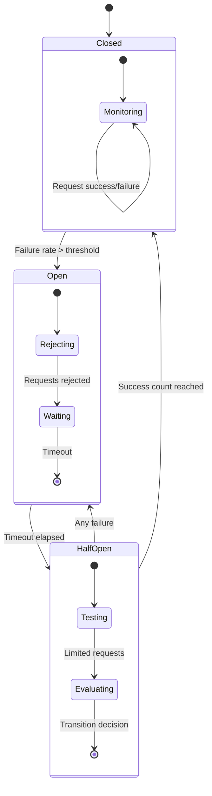
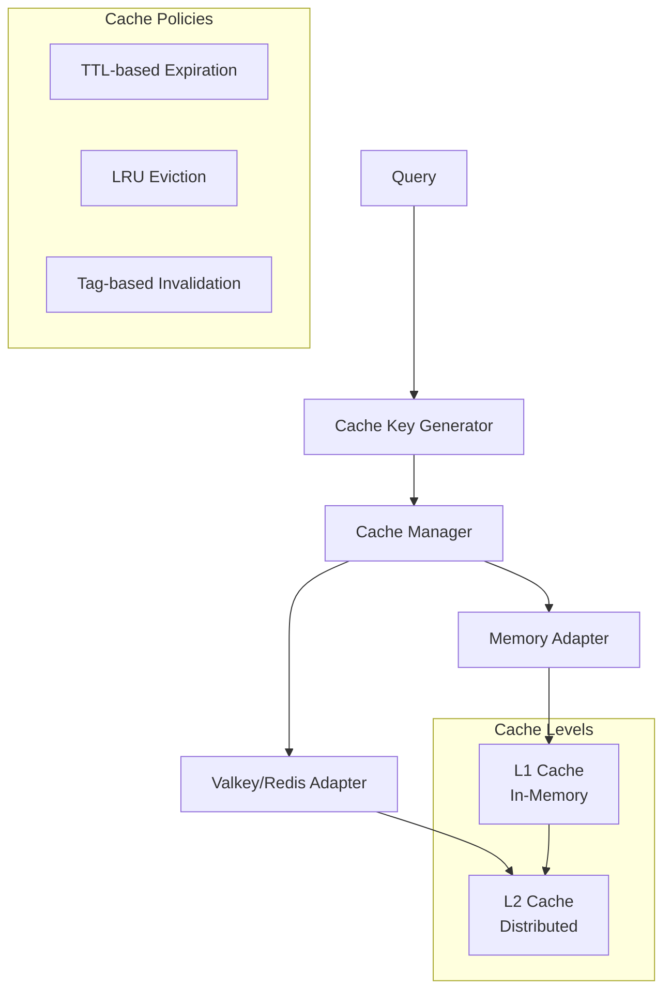
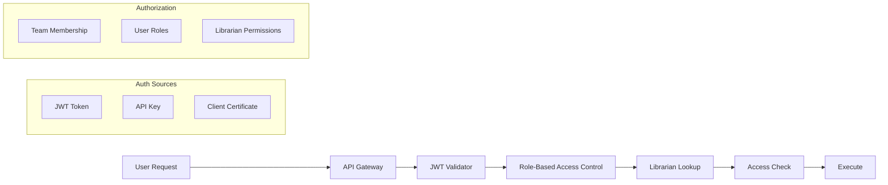
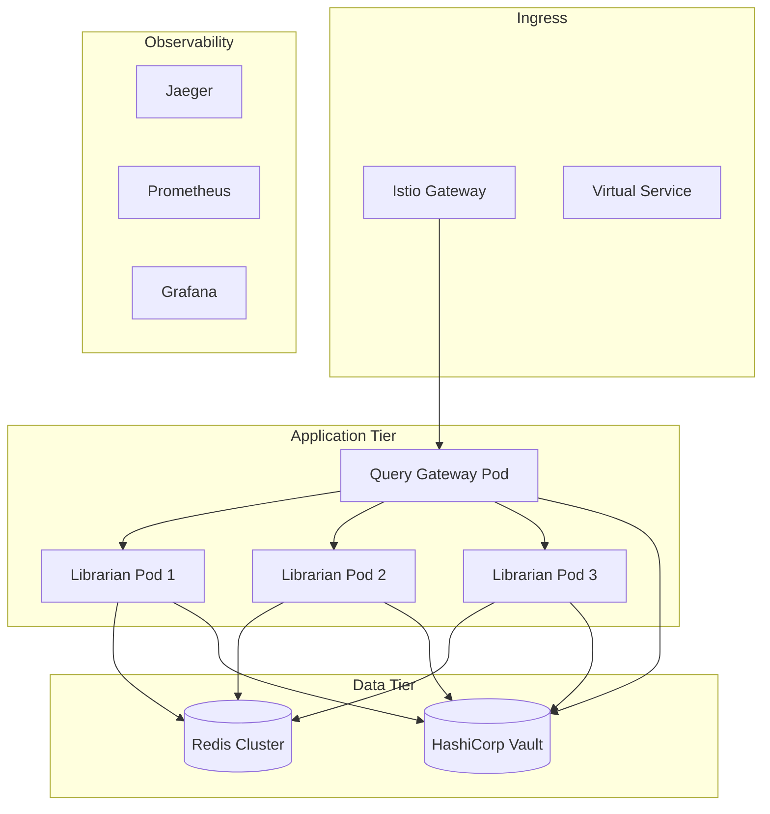
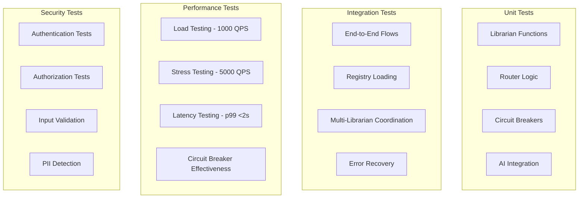

# Architectural Design Record (ADR) - Constellation

**Project:** Constellation - AI-Powered Knowledge Orchestration Framework
**Date:** 2025-01-23
**Status:** In Development
**Version:** 1.0

## Executive Summary

Constellation is a distributed AI-powered knowledge orchestration framework that enables teams to create AI-powered "librarians" providing intelligent access to enterprise data. The core principle: teams write simple async functions, the framework handles everything else.

## Problem Statement

### Current Challenges
- **Information Silos**: Enterprise knowledge is scattered across teams, tools, and systems
- **Context Switching**: Users must know which systems to query for specific information
- **Knowledge Discovery**: Finding the right expert or information source is time-consuming
- **Scalability**: As organizations grow, knowledge management becomes increasingly complex
- **Inconsistent Interfaces**: Different teams provide information through different channels

### Solution Goals
- Enable teams to create AI-powered knowledge experts ("librarians") with minimal effort
- Automatically route queries to the most appropriate experts using AI
- Provide enterprise-grade reliability, observability, and security
- Mirror organizational hierarchies naturally
- Maintain performance at scale (1000+ QPS, <2s response time)

## System Architecture

### High-Level Architecture



### Core Components

#### 1. Query Gateway
**Purpose**: Entry point for all user queries with authentication, rate limiting, and request tracking.

**Responsibilities**:
- JWT/API key authentication
- Rate limiting per user/team
- Request ID generation for tracing
- Initial context creation
- Request/response logging

**Technology**: Express.js middleware, Redis for rate limiting

#### 2. AI Delegation Engine
**Purpose**: Intelligent routing system that analyzes queries and determines the best librarian(s) to handle them.

**Capabilities**:
- Natural language query analysis
- Intent extraction and domain classification
- Multi-domain query splitting
- Capability matching using semantic similarity
- Delegation strategy selection (single/multiple/broadcast)
- Query refinement for specific experts

**AI Models Supported**:
- OpenAI GPT-4/GPT-3.5
- Anthropic Claude
- Google Vertex AI
- Local/on-premise models via LiteLLM

#### 3. Service Registry
**Purpose**: Central repository of all librarians with their capabilities, endpoints, and configuration.

**Features**:
- YAML-based configuration
- Hierarchical capability definitions
- Dynamic discovery and health checking
- Circuit breaker configuration per librarian
- SLA tracking and enforcement

#### 4. Librarian Executor
**Purpose**: Executes librarian functions with proper context enrichment, validation, and error handling.

**Features**:
- Context enrichment (user, trace, AI client)
- Response validation
- Timeout management
- Circuit breaker integration
- Caching layer integration
- Distributed tracing

#### 5. Response Aggregator
**Purpose**: Intelligently combines responses from multiple librarians into cohesive answers.

**Strategies**:
- Sequential combination by importance
- Sectioned organization by domain
- Intelligent content merging
- Conflict resolution through voting

#### 6. Observability Layer
**Purpose**: Comprehensive monitoring, tracing, and alerting for the entire system.

**Components**:
- OpenTelemetry distributed tracing
- Prometheus metrics collection
- Structured logging with correlation IDs
- Real-time dashboards
- Alert management

#### 7. Resilience Layer
**Purpose**: Ensures system reliability through failure detection, isolation, and recovery.

**Patterns**:
- Circuit breakers per librarian
- Exponential backoff retry logic
- Adaptive timeout management
- Fallback strategies (cache, delegate, static)
- Bulkhead isolation

### Data Flow

#### Simple Query Flow



#### Multi-Expert Delegation Flow



### Technology Stack

#### Core Framework
- **Language**: TypeScript/Node.js
- **Runtime**: Node.js 18+
- **Package Manager**: npm
- **Testing**: Jest

#### AI Integration
- **Primary**: LiteLLM for multi-provider support
- **Providers**: OpenAI, Anthropic, Google Vertex AI
- **Fallback**: Local models via Ollama

#### Data Layer
- **Cache**: Redis/Valkey
- **Configuration**: YAML files
- **Secrets**: HashiCorp Vault integration

#### Observability
- **Tracing**: OpenTelemetry with Jaeger
- **Metrics**: Prometheus with Grafana
- **Logging**: Pino structured logging
- **Health Checks**: Custom endpoint monitoring

#### Infrastructure
- **Orchestration**: Kubernetes
- **Service Mesh**: Istio (optional)
- **Load Balancing**: Kubernetes native
- **Storage**: S3-compatible for artifacts

### Core Interfaces

#### Librarian Function Signature

```typescript
type Librarian = (query: string, context?: Context) => Promise<Response>;

interface Response {
  answer?: string;           // Direct answer
  sources?: Source[];        // Attribution
  delegate?: DelegateRequest | DelegateRequest[]; // Delegation
  confidence?: number;       // 0-1 confidence score
  error?: ErrorInfo;         // Error details
  partial?: boolean;         // Incomplete answer flag
  metadata?: Record<string, unknown>; // Additional data
}

interface Context {
  librarian?: LibrarianInfo; // Current librarian info
  user?: User;              // Requesting user
  trace?: TraceContext;     // Distributed tracing
  delegationChain?: string[]; // Loop prevention
  ai?: AIClient;            // AI provider access
  availableDelegates?: Delegate[]; // Delegation options
  metadata?: Record<string, unknown>; // Custom data
  timeout?: number;         // Request timeout
}
```

#### Registry Schema

```yaml
librarians:
  - id: platform-team
    name: "Platform Engineering"
    description: "Kubernetes, OpenShift, CI/CD expertise"
    endpoint: https://platform.company.com/librarian
    type: specialist
    team: platform-engineering

    capabilities:
      - kubernetes.operations
      - kubernetes.troubleshooting
      - openshift.deployment
      - cicd.jenkins

    resilience:
      circuit_breaker:
        failureThreshold: 0.5
        timeout: 60000
      fallback:
        - type: cache
          config:
            ttl_minutes: 60

    sla:
      response_time_ms: 2000
      availability: 99.9
```

### AI Delegation Architecture

#### Query Analysis Pipeline



#### Delegation Strategies

1. **Single Delegation**: Route to one best-matched expert
2. **Multiple Delegation**: Split query across domain experts
3. **Broadcast Delegation**: Send to all relevant experts (emergency scenarios)
4. **No Delegation**: Handle locally if confidence is high

### Circuit Breaker Implementation

#### State Diagram



#### Configuration

```typescript
interface CircuitBreakerConfig {
  failureThreshold: number;    // 0.5 = 50% failure rate
  volumeThreshold: number;     // Min requests before evaluation
  windowSize: number;          // Time window in ms
  timeout: number;             // Time before retry attempt
  successThreshold: number;    // Successes needed to close
}
```

### Caching Strategy

#### Cache Architecture



#### Cache Key Strategy

```typescript
// Cache key generation
function generateCacheKey(
  librarianId: string,
  query: string,
  context: Context
): string {
  const contextHash = hash({
    userId: context.user?.id,
    teams: context.user?.teams?.sort(),
    // Exclude volatile context (trace, timestamps)
  });

  const queryHash = hash(query.toLowerCase().trim());

  return `constellation:${librarianId}:${queryHash}:${contextHash}`;
}
```

### Security Architecture

#### Authentication & Authorization



#### Security Layers

1. **Transport Security**: TLS 1.3 encryption
2. **Authentication**: JWT, API keys, mTLS certificates
3. **Authorization**: RBAC with team/role-based access
4. **Data Protection**: PII detection and masking
5. **Audit Logging**: All access attempts logged
6. **Secrets Management**: HashiCorp Vault integration

### Performance Architecture

#### Performance Requirements

- **Response Time**: p99 < 2000ms, p95 < 1500ms, p50 < 500ms
- **Throughput**: 1000 sustained QPS, 5000 burst QPS
- **Availability**: 99.9% uptime (43.8 minutes/month downtime)
- **Concurrency**: 10,000+ concurrent users

#### Optimization Strategies

1. **Caching**: Multi-level cache hierarchy
2. **Connection Pooling**: Redis, HTTP, database connections
3. **Parallel Execution**: Concurrent librarian calls
4. **Resource Limits**: CPU/memory constraints per librarian
5. **Smart Routing**: Avoid unnecessary delegations

### Deployment Architecture

#### Kubernetes Deployment

```yaml
apiVersion: apps/v1
kind: Deployment
metadata:
  name: constellation-gateway
spec:
  replicas: 3
  template:
    spec:
      containers:
      - name: gateway
        image: constellation/gateway:latest
        resources:
          requests:
            memory: 512Mi
            cpu: 500m
          limits:
            memory: 1Gi
            cpu: 1000m
        env:
        - name: AI_PROVIDER
          value: "openai"
        - name: REDIS_URL
          valueFrom:
            secretKeyRef:
              name: constellation-secrets
              key: redis-url
```

#### Service Mesh Integration



### Development Workflow

#### Implementation Phases

1. **Phase 1: Core Foundation** (✅ Complete)
   - Basic librarian execution
   - Simple routing
   - HTTP server

2. **Phase 2: AI Integration** (✅ Complete)
   - Multi-provider AI client
   - Query analysis
   - Response generation

3. **Phase 3: Service Registry** (🔄 In Progress)
   - YAML-based registry
   - Dynamic discovery
   - Health checking

4. **Phase 4: Delegation Engine** (📋 Planned)
   - AI-powered routing
   - Multi-expert coordination
   - Response aggregation

5. **Phase 5: Observability** (✅ Complete)
   - Distributed tracing
   - Metrics collection
   - Structured logging

6. **Phase 6: Resilience** (✅ Complete)
   - Circuit breakers
   - Retry logic
   - Fallback strategies

#### Testing Strategy



### Monitoring & Alerting

#### Key Metrics

```typescript
// Prometheus metrics
const METRICS = {
  // Request metrics
  REQUESTS_TOTAL: 'librarian_requests_total',
  REQUEST_DURATION: 'librarian_request_duration_seconds',

  // Delegation metrics
  DELEGATIONS_TOTAL: 'librarian_delegations_total',
  DELEGATION_DEPTH: 'librarian_delegation_depth',

  // AI metrics
  AI_TOKENS_USED: 'librarian_ai_tokens_used_total',
  AI_LATENCY: 'librarian_ai_latency_seconds',

  // Cache metrics
  CACHE_HITS: 'librarian_cache_hits_total',
  CACHE_MISSES: 'librarian_cache_misses_total',

  // Circuit breaker metrics
  CIRCUIT_BREAKER_STATE: 'librarian_circuit_breaker_state',
  CIRCUIT_BREAKER_TRIPS: 'librarian_circuit_breaker_trips_total',

  // Error metrics
  ERRORS_TOTAL: 'librarian_errors_total',
  TIMEOUTS_TOTAL: 'librarian_timeouts_total'
};
```

#### Alert Conditions

1. **Response Time**: p99 > 3s for 5 minutes
2. **Error Rate**: Error rate > 5% for 2 minutes
3. **Circuit Breaker**: Any circuit breaker open for > 1 minute
4. **AI Costs**: Daily AI spending > $200
5. **Cache Hit Rate**: Cache hit rate < 80% for 10 minutes

### Future Enhancements

#### Roadmap

1. **Q2 2025: Advanced AI Features**
   - Fine-tuned routing models
   - Context-aware query refinement
   - Automated capability discovery

2. **Q3 2025: Enterprise Features**
   - Multi-tenant isolation
   - Advanced RBAC
   - Compliance reporting

3. **Q4 2025: Scale & Performance**
   - Horizontal auto-scaling
   - Edge deployment
   - GraphQL API

4. **Q1 2026: Intelligence**
   - Predictive routing
   - Automated troubleshooting
   - Knowledge graph integration

### Risk Assessment

#### Technical Risks

1. **AI Provider Outages**: Mitigated by multi-provider support and fallbacks
2. **Circuit Breaker Cascades**: Prevented by proper isolation and timeouts
3. **Memory Leaks**: Addressed through resource limits and monitoring
4. **Cache Stampedes**: Handled by distributed locking in Redis

#### Operational Risks

1. **Team Adoption**: Addressed through comprehensive documentation and examples
2. **Cost Control**: Managed through AI usage monitoring and limits
3. **Security Vulnerabilities**: Mitigated by regular security scans and updates
4. **Data Privacy**: Ensured through PII detection and access controls

### Success Metrics

#### Technical KPIs

- **Response Time**: 95% of queries < 1.5s
- **Availability**: 99.9% uptime
- **Accuracy**: 90% user satisfaction score
- **Cost Efficiency**: <$0.10 per query

#### Business KPIs

- **Knowledge Discovery**: 50% reduction in time to find information
- **Expert Utilization**: 30% more efficient use of subject matter experts
- **User Adoption**: 80% of teams have at least one librarian
- **Query Success Rate**: 95% of queries receive useful responses

---

This ADR represents the comprehensive architectural design for Constellation in its intended final form, incorporating all planned features and optimizations for a production-ready AI-powered knowledge orchestration platform.
